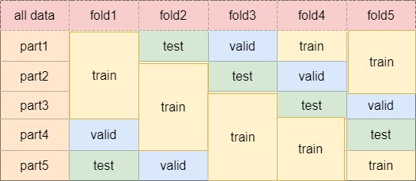

# The deep learning model and human-machine fusion for prediction of EBV-associated gastric cancer from histopathology: a discovery and multicenter validation study

This repository contains the code for identifying tumor regions and predicting EBV infection status in gastric cancer from H&E-stained FFPE histopathology slides.

## System requirements
This code was developed and tested in the following settings. 
### OS
- Ubuntu 20.04
### GPU
- Nvidia GeForce RTX 2080 Ti
### Dependencies
- Python (3.9.6)
- Pytorch install = 1.9
- torchvision (0.6)
- CUDA (10.1)
- openslide_python (1.1.1)
- tensorboardX (2.4)
Other dependencies: Openslide (3.4.1), matplotlib (3.1.1), numpy (1.18.1), opencv-python (4.1.1), pandas (1.0.3), pillow (7.0.0), scikit-learn (0.22.1), scipy (1.3.1)

## Installation guide

- Install [Miniconda](https://docs.conda.io/en/latest/miniconda.html#linux-installers) on your machine (download the distribution that comes with python3).  
  
- After setting up Miniconda, install OpenSlide (3.4.1):  
```
apt-get install openslide-python
```
- Create a conda environment with my_env.yaml:
```
conda env create -f my_env.yaml
```  
- Activate the environment:
```
conda activate env1
```
- Typical installation time: 1 hour

## Demo
### data collection
we have given a simple example of our datas' organization structure,showed in /tumor_detector/data.Each slide is a bag contains all patchs of the WSI(we just show one patch in this).
- For TCGA dataset, download diagnostic whole_slide images from (https://portal.gdc.cancer.gov/)


### preprocess dataset for training
we use the python files to convert the WSI to patches with size 515*512 pixels and taking color normalization as preprocessing.

The files are in /tumor_detector/preprocessing:
'''
- generate_patch.py
- Vahadane.main.py
'''

### train model for tumor detecting 
- To run the /tumor_detector/train.py

```bash
python detector_train.py --TrainFolder './data/stomach/Vahadane_stomach_split_10x_cancer' --TrainFolder2 './data/stomach/Vahadane_stomach_patch_10x_normal' --Comment 'resnet50,LR0.001,Decay0.0005' --FoldN 1 --Pretrain
```

### evaluate model
```bash
python detector_test.py --TrainFolder './data/stomach/Vahadane_stomach_split_10x_cancer' --FoldN 1

```
### split the interval datasets into five part for cross-validation



### classify the type of tumor
After separating the tumor region patch from the slide bag,we using the tumor patch to training a model
that could predicting the type of the tumor.

the datas' organizing way is showed in /EBV_classifier/data, you can run:

```bash
python classifier_train.py --TrainFolder './data/stomach/Vahadane_stomach_split_10x_cancer'  --Comment 'resnet50,epoch100,10x,Vahadane' --Pretrain --FoldN 1
```

### whole test(combine tumor detecting and EBV predicting)
Finally, we have integrated the detector and the classifier together to evaluate the EBVnet on the external datasets.

the wholetest_TCGA.py is for the TCGA dataset:
```bash
python wholetest.py 
```

Expected output: (example for assessment)
[0.17556531 0.8244347 ] [0.16969697 0.83030303]
label:  1
predict:  1

###See also
Thanks to works below for their implementations which is useful for this work.

[Vahadane](https://github.com/xindubawukong/Vahadane): Used for color normalization


